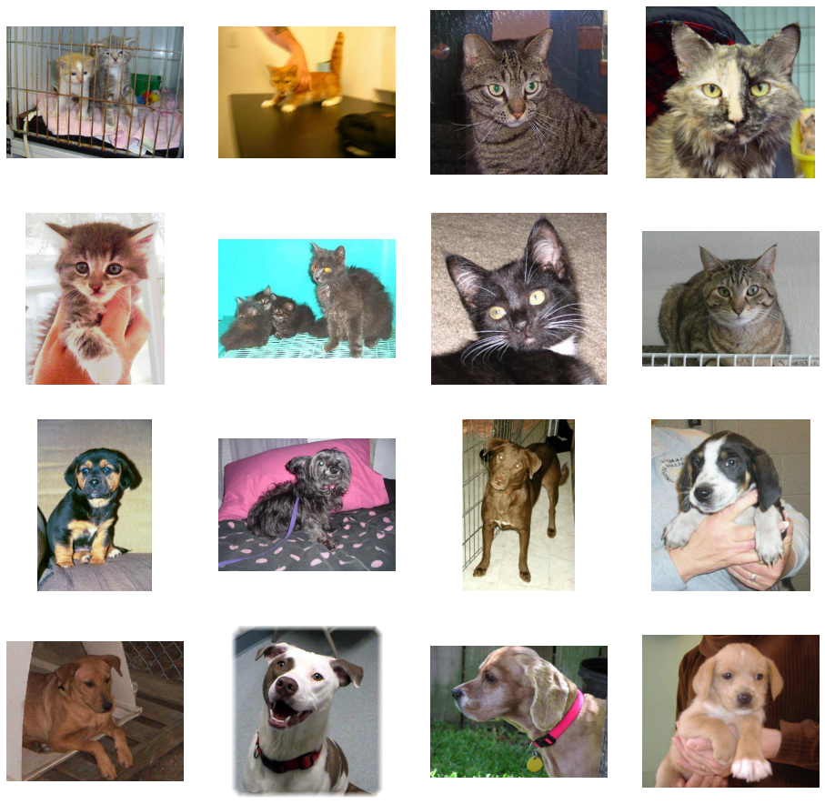

# Networks_Tensorflow

Convolutional Neural Networks in TensorFlow!

Using TensorFlow, and how, with its high level APIs you could do basic image classification, an you learned a little bit about Convolutional Neural Networks (ConvNets). and we get to go deeper into using ConvNets in this repository will real-world data, and learn about techniques that you can use to improve your ConvNet performance, particularly when doing image classification! we'll get started by looking at a much larger dataset than you've been using thus far: The Cats and Dogs dataset which had been a Kaggle Challenge in image classification!

<h3>Dataset</h3>
<ul>
<li><a href='https://www.kaggle.com/c/dogs-vs-cats'>dogs-vs-cats</a></li>
</ul>

<h3>Prerequisites:</h3>

| **Package** | **version** |
|-------------|-------------|
| Python      | 3.7.6       |
| TensorFlow       | 2.0.0  |
| Keras API | 2.3.1       |
| Jupyter Notebook		  | 6.0.3|

